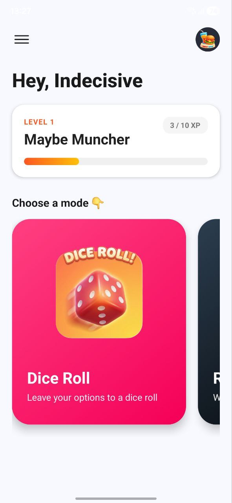
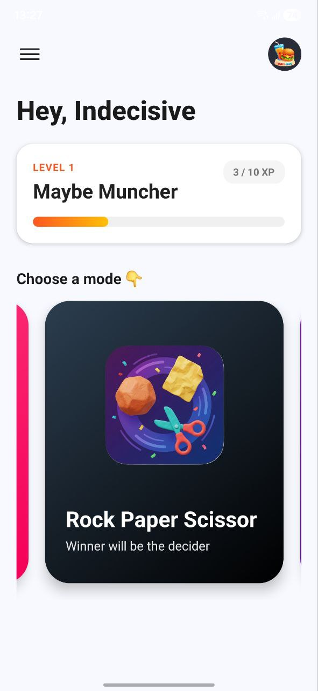
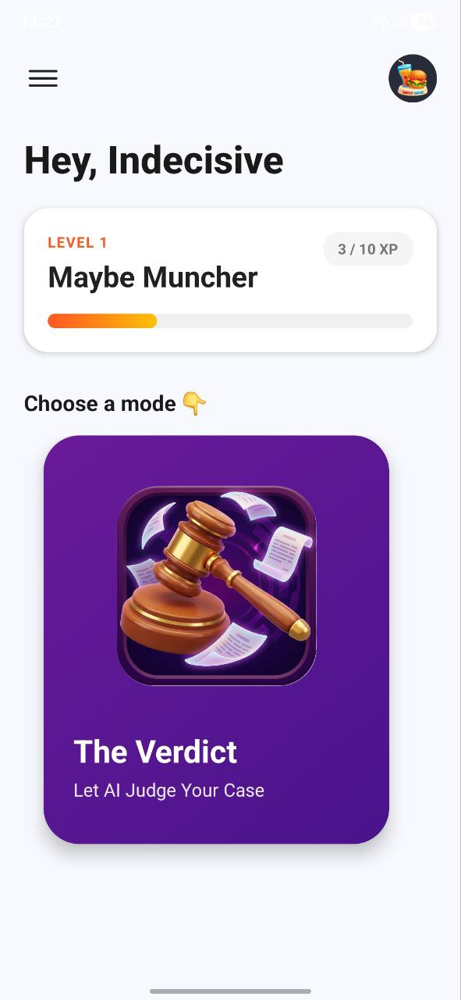

# 💎 Candid Decisions

**Candid Decisions** is a mobile application designed to transform the paralysis of choice into a lighthearted and engaging experience. It is a tool for making any choice—whether it's what to eat, what to watch, or who goes first—using a blend of classic games and **Google Gemini AI**.

---

## ✨ The Candid Experience

### 🎲 Dice Roll
Sometimes, the best choice is the one left to fate. Input your options and let the 3D dice take over. Designed for quick, low-stakes decisions to keep your momentum going.

### ✊ RPS Duel (Rock Paper Scissors)
Settle it the classic way. A real-time, synchronized duel powered by **Supabase** where the winner earns the ultimate right to be the decider. Perfect for head-to-head "friendly" debates.

### ⚖️ The Verdict (AI Arbiter)
For when the debate gets serious. Multiple users submit their choices and justifications in a shared courtroom. **Google Gemini AI** acts as the Judge, weighing the arguments and delivering a witty, definitive verdict that lightens the mood while settling the score.

---

## 🛠️ Tech Stack

- **Frontend**: [React Native](https://reactnative.dev/) + [Expo](https://expo.dev/) (SDK 51+)
- **Navigation**: [Expo Router](https://docs.expo.dev/router/introduction/) (Type-safe routing)
- **Backend / Real-time**: [Supabase](https://supabase.com/)
- **Intelligence**: [Google Gemini AI](https://ai.google.dev/)
- **Design**: Modern Glassmorphism & Vibrant Gradients for a premium, lively feel.
- **Haptics**: Tactile feedback to make every decision feel impactful.

---

## 🚀 Getting Started

### Prerequisites
- [Node.js](https://nodejs.org/) (LTS)
- npm or yarn
- [Expo Go](https://expo.dev/expo-go) app on your mobile device (for testing)

### Installation

1. **Clone the repository**:
   ```bash
   git clone https://github.com/JunnLonng/Candid-Decisions.git
   cd Candid-Decisions/mobile
   ```

2. **Install dependencies**:
   ```bash
   npm install
   ```

3. **Environment Setup**:
   Create a `.env` file in the `mobile/` directory and add your credentials (see `.env.example`):
   ```env
   EXPO_PUBLIC_GEMINI_API_KEY=your_gemini_key
   EXPO_PUBLIC_SUPABASE_URL=your_project_url
   EXPO_PUBLIC_SUPABASE_ANON_KEY=your_anon_key
   ```

4. **Start the app**:
   ```bash
   npx expo start
   ```
   Scan the QR code with your phone to open the app!

---

## 📸 Visuals & Demo 
<div align="center"> 
   <table border="0"> 
      <tr> 
         <td colspan="2" align="center"><b>Dice Mode</b></td> </tr> 
         <td width="200">  <p align="center"><b>Dice Mode</b></p> </td> 
         <td colspan="50%">  </td> 
      <tr> <td colspan="2" align="center"><b>Rock-Paper-Scissor Mode</b></td> </tr> 
         <tr> 
            <td width="50%">  <p align="center"><b>RPS Mode</b></p> </td> 
            <td width="50%">  </td> 
         </td> 
      <tr> <td colspan="2" align="center"><b>AI Verdict Mode</b></td> </tr> 
         <tr> 
            <td width="50%">  <p align="center"><b>Verdict Mode</b></p> </td> </tr> 
            <td width="50%">  
            </td> 
      </tr> 
   </table> 
</div>

---

## 🛡️ Security & Privacy
- **Candid Data**: Your choices and justifications are processed in-memory and are never stored permanently.
- **Ephemeral Sessions**: Real-time game sessions are cleaned up immediately after a decision is reached.
- **AI Privacy**: Context sent to the Gemini API is for one-time processing and is not archived by the application.

---

## 👨‍💻 Author
**Designed and Developed by JunnLong**  
[GitHub Profile](https://github.com/JunnLonng)

---

## 📜 License
This project is for personal portfolio display. All rights reserved.

